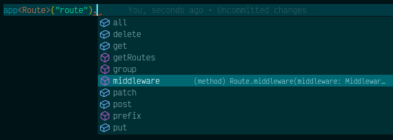

# Service Container
Lunox Service Container is inspired by Laravel's service container. The basic concept is same, but we have limitations because of nodejs nature. In Laravel, we can dynamically performing dependency injection. In Lunox, we must explicitly bind and resolve some class or instance.
## Binding
We can bind some class or function to container instance and resolve it later somewhere in your application code.
### Simple Binding
Almost all of your service container bindings will be registered on service providers. Use `bind` method to bind some class to container. In Laravel, we can bind class name to container, but there is nothing todo with nodejs. So we must use unique string to binding instance or function.
```ts
import Payment from './Service/Payment';
import db from './Support/DatabaseManager';

// bind some class
this.app.bind('Payment', Payment);

// bind function or instance
this.app.bind('Payment', ()=>new Payment('Paypall'));

// or you can bind simple object to application instance
this.app.instance('db', db);
```
`this.app` is Lunox Application instance. See [Application](https://github.com/kodepintar/lunox-framework/blob/main/src/Foundation/Application.ts) class for more detail.

Sometimes you cannot get application instance, for example outside service providers. You can use global `app()` helper to get Lunox Application instance.
```ts
app().bind('Payment', Payment);
```
### Singleton Binding
If you want bind some instance then share the instance object, use singleton instead. Once a singleton binding is resolved, the same object instance will be returned. I think you are familiar with this concept on Laravel.

```ts
import Counter from './Calc/Counter';

this.app.singleton('counter', Counter);
```

## Resolving
To resolve some object from container, currently we only suppport `make` method from application instance. We also can resolve by inserting `string` to `app()` global method. Both example are same
```ts
const payment = this.app.make('Payment');

const payment = app('Payment');
```
:::tip
We can also resolve instance with property
```ts
const payment = this.app.make("counter", {initialValue: 0})
```
:::
> Note that `app` instance are singleton

## Make Typescript Happy
When we resolve some instance, typescript didn't know what instance actually is. We can add type hinting to the actual class or interface that resolved. See this example
```ts
import type Route from 'lunox/dist/Routing/Route';

const route = app<Route>("route")
```
now the IDE can detect all instance methods and properties :smile:
