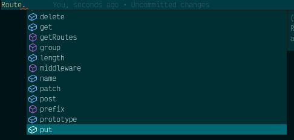

# Facades

## Introduction

Lunox Facades are similar to [Laravel Facades](https://laravel.com/docs/10.x/facades). However, there are some limitations due to JavaScript not having built-in magic methods. But don't worry, with some workarounds and effort, Lunox already provides Facades.

Let's learn more about how to use and create Lunox Facades.

## Built-in Facades

The framework comes with some built-in facades. For example, the Route facade resolves the Route factory class and allows you to call methods on it magically.

```ts
import { Route } from "@lunoxjs/core/facades";

Route.get("/someurl", () => "something");
```

There are many other facades that you can use in your application, such as `DB`, `Auth`, `Response`, `Session`, `Storage`, `Validator`, and `View`. We aim to add more helpful facades in the future.

## How Lunox Facades Work

If you check the [Lunox Framework](https://github.com/kodepandai/lunox) source code, you'll find all the facades located in the `src/Support/Facades` folder. A facade is just a regular class with a static method called `getFacadeAccessor`. This method can return either a string, Symbol or a class. If a string or Symbol is returned, Lunox will try to resolve that as an abstract name on the Container instance. If a class is returned, Lunox will register that class as a singleton and resolve it later.

Facades are fast because they cache all the called facades for later use. So if you call a facade for the second time, it will be resolved from the facade cache. Essentially, all facades behave as singletons, even if they are registered with the `bind` method, due to this caching behavior.

:::caution

Keep in mind that if you want to avoid singletons, you should not use Facades. For example, classes that handle user requests or sessions should not be resolved using singletons.

:::

## How to Create Facades

Creating a Facade is simple. Just create a class anywhere in your application that extends the Lunox `Facade` class.

```ts
import { Facade, useFacade } from "@lunoxjs/core";
import MyActualCounterClass from "../pathto/MyActualClass";

class Counter extends Facade {
  public static getFacadeAccessor() {
    return MyActualCounterClass;
  }
}

export default useFacade<MyActualCounterClass>(Counter);
```

In the example above, we don't export the `Counter` class directly. Instead, we wrap it with the `useFacade` hook. This hook is where the magic happens. We simulate the magic method behavior using this hook. `useFacade` is a generic function, so we can inject an interface to make TypeScript happy. That's why we can see IDE suggestions when we call the `Route` facade.


