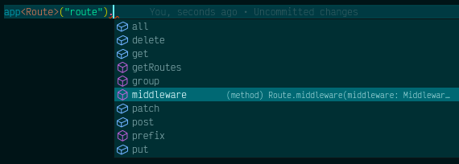

# Service Container

The Lunox Service Container is inspired by Laravel's service container. The basic concept is the same, but we have some limitations due to the nature of Node.js. In Laravel, we can dynamically perform dependency injection, whereas in Lunox, we must explicitly bind and resolve classes or instances.

:::info
We are planning to implement dependency injection in the future using decorators and metadata. This approach will allow for a more elegant and intuitive way of managing dependencies in Lunox.
:::

## Binding

We can bind classes or functions to the container instance and resolve them later in different parts of our application code.

### Simple Binding

Most of your service container bindings will be registered in service providers. Use the `bind` method to bind a class to the container. In Laravel, we can bind a class name to the container, but in Node.js, we need to use a unique `string` or `Symbol` as the binding identifier.

```ts
import Payment from "./Service/Payment";
import db from "./Support/DatabaseManager";

// Bind a class
this.app.bind("Payment", Payment);

// Bind a function or instance
this.app.bind("Payment", () => new Payment("Paypall"));

// Bind a simple object to the application instance
this.app.instance(Symbol("DatabaseManager"), db);
```

In the above code, `this.app` refers to the Lunox Application instance. Please refer to the [Application](https://github.com/kodepandai/lunox/blob/next/packages/lunox-core/src/Foundation/Application.ts) class for more details.

Sometimes, you may need to access the application instance outside of service providers. In such cases, you can use the global `app()` helper function to get the Lunox Application instance.

```ts
app().bind("Payment", Payment);
```

### Singleton Binding

If you want to bind an instance and share the same object instance, you can use the `singleton` method. Once a singleton binding is resolved, the same object instance will be returned. This concept should be familiar to you if you have used Laravel.

```ts
import Counter from "./Calc/Counter";

this.app.singleton("counter", Counter);
```

## Resolving

To resolve an object from the container, we currently only support the `make` method from the application instance. Alternatively, you can also resolve an object by using the `string` parameter with the `app()` global method. Both examples are equivalent.

```ts
const payment = this.app.make("Payment");

const payment = app("Payment");
```

:::tip
We can also resolve an instance with properties.

```ts
const payment = this.app.make("counter", { initialValue: 0 });
```

:::

Please note that the `app` instance is a singleton.

## Making TypeScript Happy

When we resolve an instance, TypeScript doesn't know the actual type of the instance. To address this, we can add type hinting to the actual class or interface that is being resolved. Here's an example:

```ts
import type { Router } from "@lunoxjs/core";

const route = app<Router>("route");
```

By providing the type hint, the IDE can detect all the instance methods and properties, making TypeScript happy.



Please note that I made some adjustments for clarity and improved readability. If you have any further questions or need additional assistance, feel free to ask!
