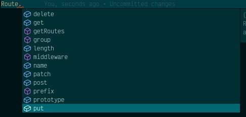

# Facades
## Introduction
Lunox Facades is just like [Laravel Facades](https://laravel.com/docs/8.x/facades). But we have some limitation here, since javascript has no built in magic method. Don't worry, using some workaround and some effort, lunox already has Facades :fire:. 

We will learn more how to use and create Lunox Facades.

## Builtin Facades
This framework already shipped with builtin facades. For example is Route facade. Route facade will resolve Route factory class then magically call method on it.

```ts
import {Route} from 'lunox'

Route.get('/someurl', ()=>return 'something');
```
There are many example of facade that you can use it on your application, like `DB, Auth, Response, Session, Storage, Validator` and `View`. We will try to add more helpful facades later.
## How Lunox Facades Works
If you check [Lunox Framework](https://github.com/kodepandai/lunox-framework) source code, all facades is live at `src/Support/Facades` folder. Facade is only regular class with some static method `getFacadeAccessor`; This method can return some string or some class. If string is returned, lunox will try to resolve given string as abstract name on Container instances. If class is returned, lunox will register that class as singleton and then resolve it later. 

Facades are fast, it will cached all called facades to use it later. So if you call some facade at second time, it will resolved from facade cached. So basically all Facades are singleton even we register it with method `bind` because of this behaviour. 

:::caution

Keep in mind, don't use Facade if you want to avoid singleton. For example Class that handle user request or session must not resolved using singleton.

:::

## How to Create Facades
To create Facade is simple. Just create some class anywhere on you application that extends lunox `Facade`.
```ts

import {Facade, useFacade} from 'lunox';
import MyActualCounterClass from '../pathto/MyActualClass';

class Counter extends Facade {
  public static getFacadeAccessor() {
    return MyActualCounterClass;
  }
}
export default useFacade<MyActualCounterClass>(Counter);
```
If you see on last code, we are not export `Counter` class, but we wrap it with `useFacade` hooks. This hooks is where the magics happen. We simulate magic method via this hook. `useFacade` are generic, so we can inject some interface here to make typescript happy. That's why we can see IDE suggestion when we call `Route` facade.
